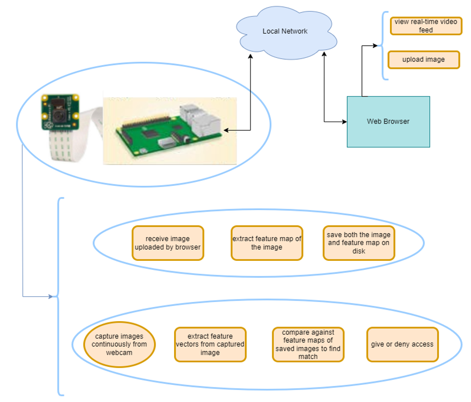
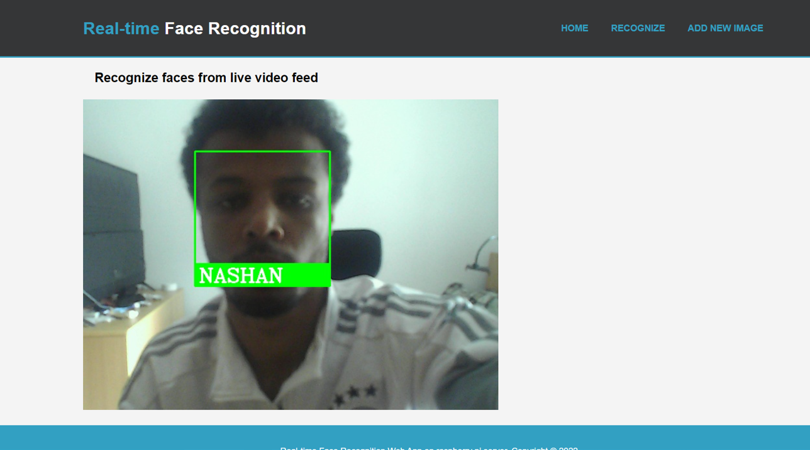

## RaspberryPi-FaceRecognition

**Real-time face recognition system built on a Raspberry Pi using Python and OpenCV with web interface.**

**Here is a diagram showing how the system works:**


**Features:**

* **Real-time Recognition:**  Fast and accurate face recognition.
* **Siamese Network:**  Robust face encoding for reliable identification.
* **Liveness Detection:**  Enhanced security to prevent spoofing.
* **Web Interface:**  Remote management and live feed monitoring.
* **OpenCV Integration:**  Leverages OpenCV for image processing.

**Getting Started:**

1. **Prerequisites:** Raspberry Pi, for required packages (see `requirements.txt`).
2. **Installation:**
   ```bash
   git clone https://github.com/ntily/RaspberryPi-FaceRecognition.git
   pip install -r requirements.txt
   # Configure camera and web interface settings
   ```
3. **Run:** `python app.py`

**Usage:**

* **Register Faces:** Access the web interface (usually `http://<raspberry-pi-ip-address>:5000`) and use the "Add New Image" feature.
* **Recognition:** The system automatically detects and recognizes registered faces.
* **Access Control:** Upon successful recognition, the system triggers connected resources (e.g., unlocks a door, mark attendance).

**Project Structure:**

```
RaspberryPi-FaceRecognition/
├── app.py          # Main application
├── prepare_data.py  # Data preparation
├── search_image.py # Face searching
├── do_task.py      # Do task based on recognition result
├── templates/       # Web interface templates
├── static/          # Web interface static files
└── requirements.txt # Required packages
```

Screenshots:
Web Interface - Live Feed - Face Recognition in Action:

